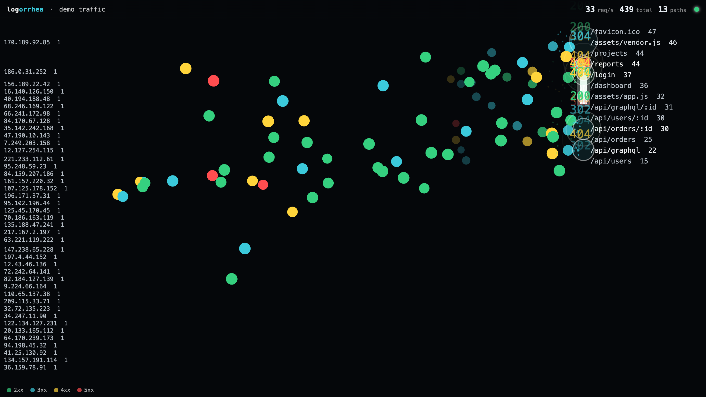

# logorrhea

> *logorrhea (n.) — an excessive flow of words.* In this case, of logs.

A [Logstalgia](https://logstalgia.io/)-inspired live traffic visualizer for
[Traefik](https://traefik.io/) running in Kubernetes, rendered in the browser.
Every request flies across the screen as a ball and gets bounced by a paddle —
colour is the HTTP status, radius is the response size, busy routes float to
the top.



```
Traefik access logs ──stern──▶ Bun/Elysia ──WebSocket──▶ React + PixiJS
   (JSON, in cluster)            parse + filter            ball/paddle viz
```

- **server/** — Bun + Elysia. Tails the Traefik pods' access logs with
  [`stern`](https://github.com/stern/stern), parses the JSON access-log format,
  optionally filters to one service, and fans request events out over `/ws`.
  Also serves the built frontend.
- **web/** — React + Vite + PixiJS. Each request is a ball launched from the
  left (vertical origin keyed to the client host), flown to its path's lane on
  the right, met by a tracking paddle, and bounced.

Under load, events are batched into short frames and similar routes are
consolidated (numeric ids, UUIDs, content hashes, and hashed asset filenames
collapse into one lane), so the picture stays readable from a trickle to a
flood.

## Requirements

- [Bun](https://bun.sh) ≥ 1.x (the Docker image takes care of this in
  production)
- For live traffic:
  - [`stern`](https://github.com/stern/stern) on the `PATH` (bundled in the
    Docker image)
  - a kubeconfig — or, in-cluster, a service account — that can read the
    Traefik pods' logs
  - Traefik configured with **JSON access logs** (`--accesslog=true
    --accesslog.format=json`)

## Quick start (no cluster needed)

```sh
# Terminal 1 — backend with synthetic demo traffic:
cd server && bun install && LOGORRHEA_DEMO=1 bun --watch index.ts

# Terminal 2 — frontend dev server (proxies /ws to :8080):
cd web && bun install && bun run dev
```

Open the URL Vite prints. Crank `LOGORRHEA_DEMO_RPS=500` to watch the adaptive
batching coarsen under a flood.

## Live traffic

Run the backend somewhere it can reach your cluster and drop `LOGORRHEA_DEMO`:

```sh
cd server && bun index.ts
```

By default it tails every pod matching `app.kubernetes.io/name=traefik` in the
`traefik` namespace and visualizes **all** ingress traffic. To watch a single
service, set a filter:

```sh
LOGORRHEA_FILTER_REGEX=myservice bun index.ts
```

## Docker

```sh
docker build -t logorrhea .
docker run -p 8080:8080 -e LOGORRHEA_DEMO=1 logorrhea
```

The image bundles `stern` and the built frontend. For live traffic, mount a
kubeconfig (or deploy in-cluster with a service account bound to a role that
allows `get`/`list`/`watch` on pods and `get` on `pods/log` in the Traefik
namespace) and set `LOGORRHEA_*` env vars as needed.

## Configuration (env)

| Var | Default | Purpose |
|-----|---------|---------|
| `PORT` | `8080` | HTTP/WS listen port |
| `LOGORRHEA_DEMO` | — | `1` = synthetic traffic, no cluster needed |
| `LOGORRHEA_DEMO_RPS` | `12` | Synthetic requests/second in demo mode |
| `LOGORRHEA_TITLE` | `live traffic` | Title-bar text |
| `LOGORRHEA_TRAEFIK_NAMESPACE` | `traefik` | Namespace to tail |
| `LOGORRHEA_TRAEFIK_SELECTOR` | `app.kubernetes.io/name=traefik` | Pod selector |
| `LOGORRHEA_TRAEFIK_CONTAINER` | `traefik` | Container to tail |
| `LOGORRHEA_TAIL` | `0` | Lines to backfill on start |
| `LOGORRHEA_FILTER_REGEX` | — | If set, only visualize lines whose filter field matches this regex |
| `LOGORRHEA_FILTER_FIELD` | `ServiceName` | Traefik access-log field the filter regex is matched against |
| `LOGORRHEA_FRAME_MS` | `100` | Frame batching interval (ms) |
| `LOGORRHEA_NORMALIZE` | `1` | `0` = don't consolidate ids/hashes in paths |
| `LOGORRHEA_MASSIVE_AT` | `250` | Events/frame beyond which grouping coarsens to status class + top-N |
| `LOGORRHEA_TOP_GROUPS` | `40` | Lanes kept when grouping is coarsened |

## A note on exposure

This is an ops dashboard, not a public-facing app:

- The `/ws` endpoint (and the page itself) is **unauthenticated**. Anyone who
  can reach the port sees your traffic. Put it behind an authenticating
  ingress/proxy or keep it on an internal network.
- **Client IP addresses** from the access logs are displayed on screen (the
  left column), along with request paths and status codes. Consider that
  before giving people access.

## Development

```sh
cd server && bun run typecheck   # tsc --noEmit
cd web && bun run build          # tsc --noEmit && vite build
```

The wire protocol between server and web lives in `web/src/types.ts` and is
intentionally tiny: a `config` message on connect, then `frame` messages each
carrying consolidated request groups.

## License

[MIT](LICENSE)
